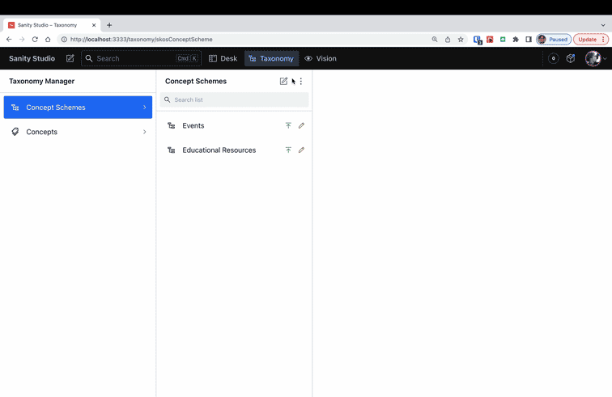
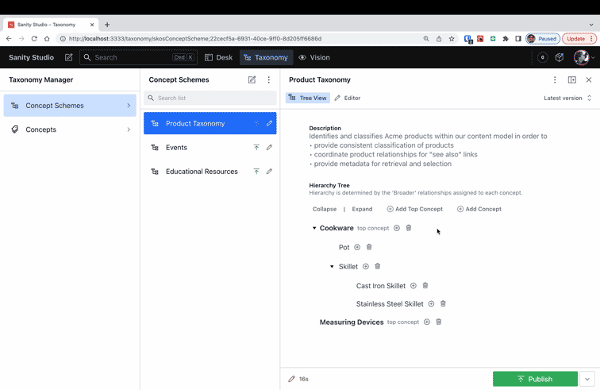

<h1 class="title">Documentation</h1>

[filename](_includes/shields.md ':include')

<p class='large'>Sanity Taxonomy Manager adds a set of tools and two document types to your Sanity Studio &mdash; SKOS Concept and SKOS Concept Scheme &mdash; that you can use to create, organize, and use standards compliant taxonomies.<p>

## Getting Started

### Installation

In your Sanity project folder, run

```bash
npm i sanity-plugin-taxonomy-manager
```

or

```bash
yarn add sanity-plugin-taxonomy-manager
```

### Configuration

Add `taxonomyManager()` to the plugins array of your [project configuration](https://www.sanity.io/docs/configuration#51515480034b). this will make the Taxonomy Manager Tool available in your studio workspace.

```js
// sanity.config.js

import {defineConfig} from 'sanity'
import {deskTool} from 'sanity/desk'
import {taxonomyManager} from 'sanity-plugin-taxonomy-manager'
import {schemaTypes} from './schemas'

export default defineConfig({
  name: 'default',
  title: 'Sanity Studio',
  projectId: '<projectId>',
  dataset: 'production',
  plugins: [
    deskTool(),
    // Include the taxonomy manager plugin
    taxonomyManager({
      // Optional: Set a Base URI to use for new concepts & concept schemes
      baseUri: 'https://example.com/',
    }),
  ],
  schema: {
    types: schemaTypes,
  },
})
```

The plugin adds `skosConcept` and `skosConceptScheme` document types to your studio. If you display all documents by default, you can use a filter on `documentTypeListItems` in the [desk tool configuration](https://www.sanity.io/docs/desk-tool-api) to exclude taxonomy manager document types from your main document view.

```js
// sanity.config.js

import {defineConfig} from 'sanity'
import {deskTool} from 'sanity/desk'
import {taxonomyManager} from 'sanity-plugin-taxonomy-manager'
import {schemaTypes} from './schemas'

export default defineConfig({
  name: 'default',
  title: 'Sanity Studio',
  projectId: '<projectId>',
  dataset: 'production',
  plugins: [
    deskTool({
      structure: (S) =>
        S.list()
          .title('Content')
          .items([
            ...S.documentTypeListItems().filter(
              (listItem) => !['skosConcept', 'skosConceptScheme'].includes(listItem.getId())
            ),
          ]),
    }),
    taxonomyManager({
      baseUri: 'https://example.com/',
    }),
  ],
  schema: {
    types: schemaTypes,
  },
})
```

### Options

The `baseURI` option allows you to set a default URI (Uniform Resource Identifier) for new concepts and concept schemes. Unique identifiers allow for the clear an unambiguous identification of concepts across namespaces, for example between `https://shipparts.com/vocab/Bow` and `https://wrappingsupplies.com/vocab/Bow`. The base URI of these concepts is `https://shipparts.com/vocab/` and `https://wrappingsupplies.com/vocab/`, respectively.

- In most cases, it makes sense for your base URI to be a directory or subdirectory of your website.
- In all cases, the URI you choose should be in a domain that you control.
- The `baseUri` default is optional. If you omit it, the Base URI for new concepts and concept schemes is pre-populated based on the most recently used Base URI value.

## Building Taxonomies

### Creating Concept Schemes

[SKOS Concept Schemes](https://www.w3.org/TR/skos-reference/#schemes) allow you to group individual concepts (sometimes referred to as terms) together as individual taxonomies, thesauri, or classification schemes. While concepts can be created and used as standalone entities, concept schemes offer a convenient way to namespace and describe terms and relationships designed for specific purposes. 



When you add a new concept scheme, Taxonomy Manager will prompt to you add a name and description, and will then prompt you to start adding concepts. If you have not set a default `baseUri`, the scheme will be created with the most recently used base URI. If you have not yet created any other concepts or schemes, you will need to enter a base URI in the editor tab before you can publish the scheme. 

### Adding Concepts

You can create SKOS Concepts via Sanity Studio's New Document buttons, or from within a SKOS Concept Scheme. Creating concepts within a scheme automatically adds concepts to the scheme in question, and creates hierarchical relationships between terms based on where in the tree view they are added.  

- **Top Concepts** are, by convention, used to signify the topmost concepts in the hierarchical relations for that scheme. Top Concepts can be used to denote the broadest categories in a hierarchy, or to describe facets in a faceted taxonomy.  


- **Concepts** are the fundamental elements of a SKOS vocabulary. Concepts are the ideas, meanings, or (categories of) objects and events which underlie your knowledge organization systems. Concepts are distinct from the labels used to refer to them. This distinction is important because it is what allows you to change and iterate the details of labels based on performance or user expectations, and to localize concepts with labels in different languages without changing the meaning or semantics of your scheme.  


All fields _except_ Preferred Label and Base IRI are optional, and are to be used as best fits the needs of your information modeling task. All Concept fields map to elements of the machine readable data model described in the [W3C SKOS Recommendation](https://www.w3.org/TR/skos-reference/).

## Adding Schemes to Documents
Taxonomy Manager includes two Reference Filter helpers to help you include whole taxonomies or individual taxonomy branches in your document schemas. The filters use the automatically generated concept/scheme ID that is appended to your base URI to create the concept/scheme RDF identifier:


### Scheme Filter
To allow a `reference` field to access any term in a SKOS Concept Scheme, use the `schemeFilter` helper. The `schemeFilter` helper takes one parameter: the RDF URI ID from the Concept Scheme you want to use, located just below the `Base URI` field. Copy the identifier that follows your Base URI and use it as the value for `schemeId` in the `schemeFilter` settings object: 

```js
import {schemeFilter} from 'sanity-plugin-taxonomy-manager'

...

defineField({
    name: 'gradeLevel',
    title: 'Grade Level',
    type: 'reference',
    to: {type: 'skosConcept'},
    options: {
      filter: () => schemeFilter({schemeId: 'f3deba'}),
      disableNew: true,
    },
  }),
```

### Branch Filter
To limit a `reference` field to a particular branch in a SKOS Concept Scheme, use the `branchFilter` helper. The `branchFilter` helper takes two parameters: the RDF URI ID from the Concept Scheme you want to use and the Concept ID in that Scheme to whose children your field is limited. The Concept ID can be a Top Concept, or any other concept (with children) in your scheme:

```js
import {branchFilter} from 'sanity-plugin-taxonomy-manager'

...

defineField({
    name: 'subject',
    title: 'Subject',
    type: 'reference',
    to: {type: 'skosConcept'},
    options: {
      filter: () => branchFilter({schemeId: 'f3deba', branchId: '25f826'}),
      disableNew: true,
    },
  }),
```
